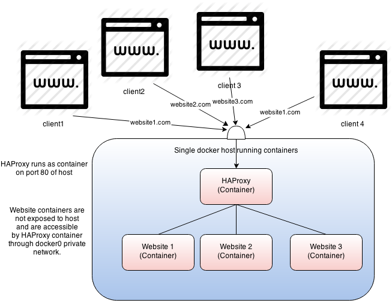

# docker-config

These are the config files for my webserver. 

I use [Alpine Linux](https://alpinelinux.org/) with [nginx](https://nginx.org/) for a webserver and [HAProxy](http://www.haproxy.org/) as a reverse proxy. All of that it individually containerized with [Docker](https://www.docker.com/) (specifically using [nginx:alpine](https://github.com/nginxinc/docker-nginx/blob/f603bb3632ea6df0bc9da2179c18eb322c286298/mainline/alpine/Dockerfile) and [haproxy:alpine](https://github.com/docker-library/haproxy/blob/7837715e428efe0943053aae0130c709d017fd81/1.8/alpine/Dockerfile)). 


> image by [Sam Stoelinga](http://samos-it.com/posts/docker-multi-website-single-ip-host-haproxy.html), drawn with [draw.io](http://draw.io/)

## Building and running
GNU Make glues everything together, so all I have to do is:

```console
$ make build
$ make run
```

## Further Reading

* [Docker Multiple websites/domains on single ip/host tutorial using a HAproxy as reverse proxy](http://samos-it.com/posts/docker-multi-website-single-ip-host-haproxy.html)
* [Serving multiple web apps using HAProxy and Docker containers](https://webthoughts.koderhut.eu/serving-multiple-web-apps-using-haproxy-and-docker-containers-c2ca5e52a748)
